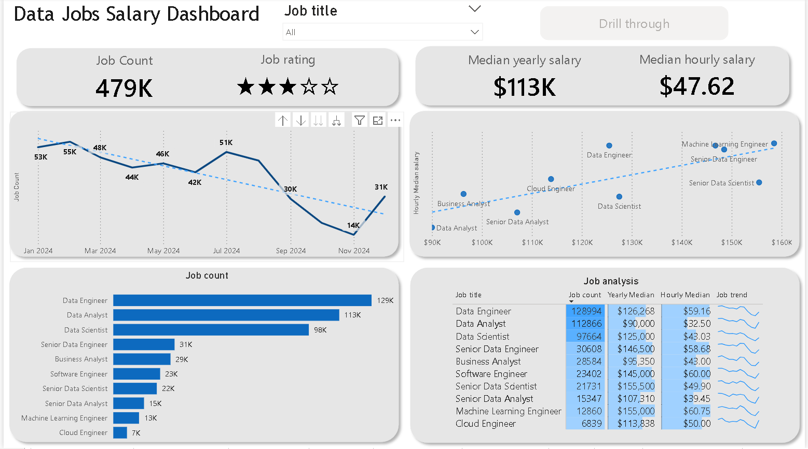
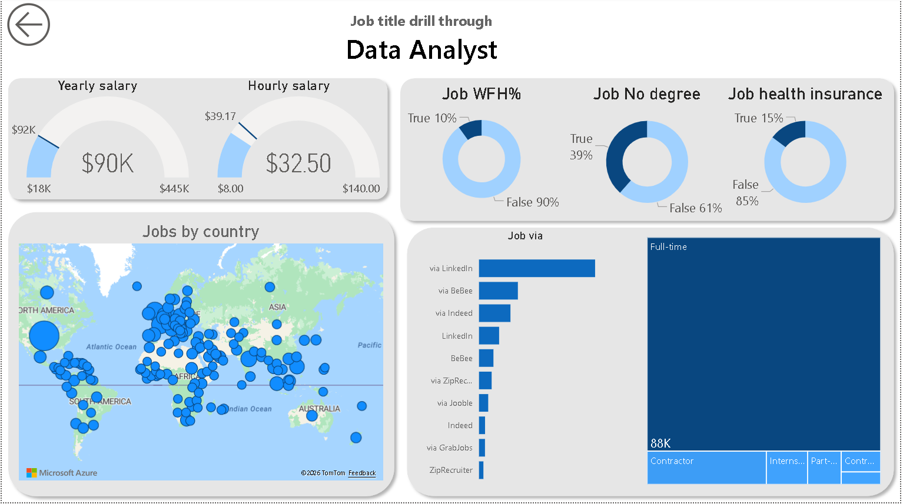

# 📊 Data Jobs Salary Dashboard (Power BI)

## 🧠 Project Overview
This project is an **interactive Power BI dashboard** designed to analyze **data-related job roles** across the global market.

The dashboard provides insights into:
- 💼 Job availability across data roles
- 💰 Salary trends (yearly & hourly)
- 🌍 Geographic distribution of jobs
- 🏠 Remote work, degree requirements, and benefits
- 📈 Job trends and hiring platforms

### 🎥 Dashboard Walkthrough Video
[<video controls src="../images/video.mp4" title="Title"></video>](https://github.com/yashshakya-1998/Data-jobs-salary-dashboard/issues/1#issue-3894302648)

The goal is to help aspiring and working data professionals make **data-driven career decisions**.

---

## 🧰 Tools & Technologies Used
- 📊 **Power BI** – Dashboard creation & data visualization
- 🗄️ **Dataset (Job Market Data)** – Data cleaning and modeling
- 🧠 **DAX** – Measures and calculated insights
- 💻 **VS Code** – Documentation & project presentation
- 🌱 **Git & GitHub** – Version control and sharing

---

## 🧩 Skills Demonstrated
- 📊 Data Visualization & Storytelling
- 🧠 Analytical Thinking
- 🧮 DAX Measures
- 🧱 Data Modeling
- 🎯 Dashboard Design & UX
- 📈 Career & Market Analysis

---

## 📊 Dashboard Pages & Analysis

---

### 1️⃣ Data Jobs Salary Overview
📸 **Dashboard Snapshot:**  

#### 🔎 What this dashboard shows
- Total job count across data roles
- Median yearly and hourly salaries
- Job rating distribution
- Monthly job posting trends
- Comparison of job roles by salary and demand

#### 💡 Key Insights
- **Median yearly salary:** ~$113K  
- **Data Engineer and Data Scientist** roles command higher salaries
- Job postings show a **declining trend over time**
- Higher-paying roles correlate with more specialized job titles

**Insight:**  
> Advanced and specialized data roles consistently outperform generalist roles in compensation.

---

### 2️⃣ Data Analyst Drill-Through Analysis
📸 **Dashboard Snapshot:**  

#### 🔎 What this dashboard shows
- Median yearly and hourly salary for Data Analysts
- Work-from-home availability
- Degree requirements
- Health insurance coverage
- Job distribution by country
- Hiring platforms and employment type

#### 💡 Key Insights
- **Median salary:** ~$90K yearly / $32.50 hourly
- Only **~10%** of roles are fully remote
- **39%** of jobs do not require a formal degree
- Majority of roles offer **health insurance**
- LinkedIn is the dominant hiring platform
- Most roles are **full-time**, followed by contract positions

**Insight:**  
> Data Analyst roles offer strong entry points into the data field, with flexibility in education requirements and global opportunities.

---

## 📌 Key Takeaways
- Data careers remain **high-paying and in demand**
- Salary increases with **seniority and specialization**
- Remote opportunities exist but are limited
- Visualization tools like Power BI are powerful for uncovering career insights

---

## 🚀 Conclusion
This Power BI dashboard transforms raw job market data into **clear, actionable insights** for data professionals.  
It highlights how **role selection, skill growth, and market awareness** can significantly impact career outcomes.

---

## 📂 Project Assets
- 📊 Power BI Dashboard File: *([File](Data_jobs_dashboard.pbix))*

---

## ⭐ Final Note
This project demonstrates how **data visualization and analytics** can be used beyond business problems — to guide **real-world career decisions**.
