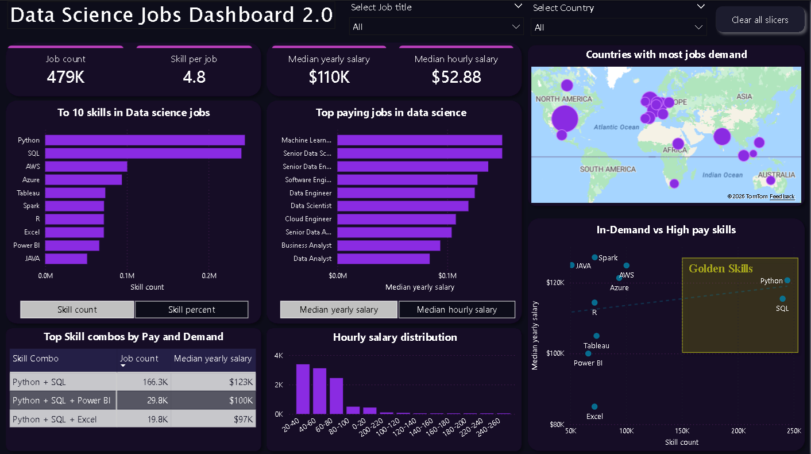

# 📊 Data_jobs_advanced_powerbi_dashboard 🚀

An advanced end-to-end **Power BI dashboard project** focused on analyzing Data Science job market trends, salary insights, skill demand, and skill combinations. 📈💼  

This dashboard demonstrates strong skills in **Power BI, DAX, Data Modeling, and Business Analytics.** 🔥

---

## 🛠️ Skills & Tools Used

- 💜 Power BI Desktop  
- 🧮 DAX (Data Analysis Expressions)  
- 📊 Explicit Measures (CALCULATE, TREATAS, MEDIAN, DIVIDE, etc.)  
- 📈 Implicit Measures  
- 🔄 Power Query (Data Cleaning & Transformation)  
- 🔗 Data Modeling & Relationships (Star Schema)  
- 📅 Date Dimension Table  
- 🎯 KPI Analysis  
- 📉 Advanced Charts & Custom Visual Formatting  
- 🌍 Map Visualizations  
- 📌 Field Parameters  
- 📦 Skill Combination Logic using DAX  

---

## 📌 Dashboard Overview

### 🔢 KPI Cards
- 📊 Total Job Count  
- 🧠 Average Skills per Job  
- 💰 Median Yearly Salary  
- ⏳ Median Hourly Salary  

These KPIs provide a quick executive summary of the data job market. 🚀  

---

### 🧠 Top 10 Skills in Data Science Jobs
- 📈 Bar chart showing most in-demand technical skills  
- 🔄 Toggle between Skill Count and Skill Percent  
- 🎯 Helps identify dominant technologies like Python, SQL, AWS  

---

### 💰 Top Paying Jobs in Data Science
- 📊 Bar chart ranking job titles by median salary  
- 🔄 Toggle between yearly and hourly salary  
- 💡 Useful for career path comparison  

---

### 🌍 Countries with Highest Job Demand
- 🗺️ Map visualization showing job concentration by country  
- 📍 Bubble size represents job demand  
- 🌎 Helps understand geographic opportunities  

---

### 🔥 In-Demand vs High-Pay Skills (Golden Skills Zone)
- 📊 Scatter plot comparing skill demand vs salary  
- 🟨 Highlighted "Golden Skills" quadrant  
- 🎯 Identifies skills that are both high-paying and high-demand  

---

### 🔗 Top Skill Combos by Pay and Demand
- 📦 Custom DAX-built skill combinations (Python + SQL, etc.)  
- 📊 Job Count per combo  
- 💰 Median Salary per combo  
- 🚀 Advanced filtering using TREATAS and virtual relationships  

---

### ⏱️ Hourly Salary Distribution
- 📉 Histogram-style distribution  
- 📊 Shows how salary spreads across different pay ranges  
- 💡 Useful for market benchmarking  

---

## 🧮 Advanced DAX Concepts Applied

- 🔥 CALCULATE for context transition  
- 🔄 TREATAS for virtual relationships  
- 📊 MEDIAN calculations on filtered job sets  
- 📈 DIVIDE for percentage calculations  
- 🧠 FILTER, VALUES, INTERSECT, UNION for combo logic  
- 🎯 Context manipulation (Filter vs Row Context understanding)  

---

## 📊 Data Model Architecture

- ⭐ Star Schema Model  
- 🧾 job_postings_fact (Fact Table)  
- 🧠 skills_job_dim (Bridge Table)  
- 🗂️ skills_dim (Dimension Table)  
- 📅 date_dim (Calendar Table)  
- 🔗 One-to-Many Relationships  

---

## 🎨 Design & UX Features

- 🌌 Dark theme professional layout  
- 💜 Consistent purple visual theme  
- 📌 Slicers for Job Title & Country  
- 🧼 Clear All Slicers button  
- 🎛️ Field Parameter Toggle Buttons  
- 🟨 Highlighted Insight Zones  

---

## 🎯 Business Questions Answered

- 📈 What skills are most in demand?  
- 💰 Which roles pay the highest salaries?  
- 🌍 Which countries have the highest demand?  
- 🔥 Which skills fall into the "Golden Skills" category?  
- 📦 Which skill combinations increase salary potential?  
- 📊 What does salary distribution look like across the market?  

---

## 🚀 Key Takeaways

- 🐍 Python + SQL dominates job demand  
- 💰 Machine Learning roles command higher median salaries  
- 🌍 Demand is concentrated in specific regions  
- 🔥 Skill combinations significantly impact earning potential  
- 📊 Data modeling + DAX unlock powerful analytical capabilities  

---

## 🧠 Project Level

✅ Intermediate → Advanced Power BI  
✅ Strong DAX & Data Modeling  
✅ Real-world market analysis use case  

---

## 📌 Conclusion

Built as an advanced portfolio project to demonstrate strong Power BI and analytical expertise. 🚀📊  

